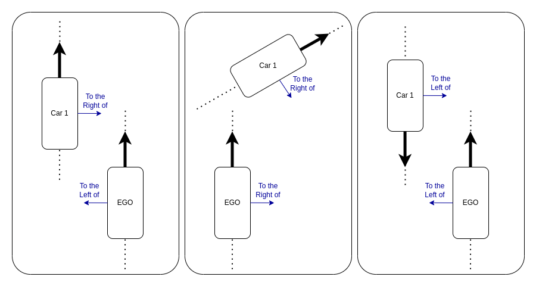
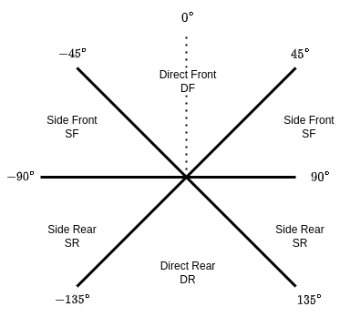

<h1>S<sup>3</sup>C: Spatial Semantic Scene Coverage for Autonomous Vehicles</h1>
This repository contains code and scripts to reproduce the results from S<sup>3</sup>C: Spatial Semantic Scene Coverage for Autonomous Vehicles.

# Requirements
This has been tested on Ubuntu 18.04 and 20.04.
The code uses anaconda and Python 3.9, which must be installed on the host system.
Running `source env.sh` (which is done automatically by the below scripts), will set up a conda environment called `sg` and install all Python requirements.

# Generating Figures and Data
The `study_data` contains scripts for generating the figures and tables in the paper.
The `study_data/carla_clusters/` folder contains the precomputed clusterings of the 5 techniques explored in Section 4.2.
The `study_data/model_results/` folder contains a CSV file with the predictions of the trained model for the entire train and test splits of the data.

To recreate the figures and data, run:

```bash
source study_data/generate_figures.sh
```

This will take ~10-15 minutes. It generates intermediate data used by RQ1 and RQ2 in `study_data/results`. The final figures are stored in `study_data/figures/`.

## Figure information
The final figures are stored in `study_data/figures/`.

| Paper Figure | File                                                                  | Description                                                                                                                                                                                                                                                                                           |
|--------------|-----------------------------------------------------------------------|-------------------------------------------------------------------------------------------------------------------------------------------------------------------------------------------------------------------------------------------------------------------------------------------------------|
| Fig. 3       | `study_data/figures/cluster_viz_carla_rsv.png`                        | Distribution of images across scene graph equivalence classes for the *ELR* abstaction.                                                                                                                                                                                                               |
| Fig. 4       | `study_data/figures/num_clusters_80_20_trivial_inner_legend.png`      | Percentage of test failures not covered in training vs count of equivalence classes under different abstractions.                                                                                                                                                                                     |
| Fig. 5       | `study_data/figures/tree.png` and `study_data/figures/tree_small.png` | Test fail and Train classification tree for the *ELR* abstraction. NOTE: `tree.png` is 30,000 by 30,000 pixels to allow for zooming in to read the predicates. This file may not load on some machines. Fig. 5 shows `tree_small.png` (1,500 by 1,500 pixels) to visualize the structure of the tree. |

### File naming scheme
In the paper, we introduce 5 abstractions, *E*, *EL*, *ER*, *ELR*, and *ERS*.
The short names used in the file names are different. The various figures and supporting data use the below naming scheme.

| Short Name | Long Name                    | Description                                                               | File Ending |
|------------|------------------------------|---------------------------------------------------------------------------|-------------|
| *E*        | Entities                     | Semantic Segmentation                                                     | `_sem`      |
| *EL*       | Entities + Lanes             | *E* with ground-truth lane occupation for each entity                     | `_no_rel`   |
| *ER*       | Entities + Relations         | *E* with RoadScene2Vec's default inter-entity relationships configuration | `_sem_rel`  |
| *ELR*      | Entities + Lanes + Relations | *E* with both lane and relationship information from *EL* and *ER*        | `_rsv`      |
| *ERS*      | Entities + Road Structure    | *EL* except lanes are modeled as multiple detailed road segments          | `_abstract` |


# SGG Configuration Space
As noted in Section 4.1, we utilize the default inter-entity relationship configuration from RoadScene2Vec.
By default, we only allow for relationships between the ego vehicle and other entities, but this can be extended to allow for relationships between any pair of entities, e.g. between cars and trucks, which can be separately configured for both distance and angular relationships.

## Distance relationships
The distances used to define the relationships in the graph are tunable.
We utilized the 5 default parameterization used by RoadScene2Vec, and a maximum distance of 50 meters.

| Criteria            | Short Name   | Long Name                    |
|---------------------|--------------|------------------------------|
| *dist* <= 4m        | `near_coll`  | Near Collision               |
| 4m < *dist* <= 7m   | `super_near` | Super Near                   |
| 7m < *dist* <= 10m  | `very_near`  | Very Near                    |
| 10m < *dist* <= 16m | `near`       | Near                         |
| 16m < *dist* <= 25m | `visible`    | Visible                      |
| 25 < *dist* <= 50m  | N/A          | No Distance Relation         |
| 50 < *dist*         | N/A          | Entity not included in graph |

## Angular Relationships
The angular relationships are divided into 2 categories.

The first captures a single relationship of left versus right and is given relative to the vehicle; this is not parameterizable.
Note that it is possible for two vehicles to both be on each others' left or right.
Consider the scenarios in the image below.
In the first case, car 1 is to the left of the ego, and ego is to the right of car 1 because they are both travelling in the same direction.
In the second case, both ego and car 1 are to the right of each other because car 1 is turned at an angle.
In the third case, both ego and ar 1 are to the left of each other because they are facing opposite directions.



The second captures information about front versus rear and side versus direct, giving 4 combinations: Direct Front (DF), Side Front (SF), Direct Rear (DR), Side Rear (SR).
This is parameterizable by defining the threshold between these distinctions.
The default parameterization uses 45 degree increments, giving each of the 4 combinations 90 degrees total, as shown below:


