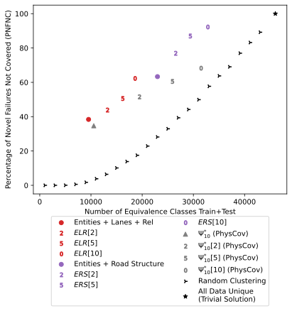

<h1>S<sup>3</sup>C: Spatial Semantic Scene Coverage for Autonomous Vehicles</h1>
This repository contains code and scripts to reproduce the results from S<sup>3</sup>C: Spatial Semantic Scene Coverage for Autonomous Vehicles.

# Table of Contents
* :star: <mark>PhysCov</mark>
* :star: <mark>System vs Model-level Testing</mark>
* :star: <mark>Considerations for Developing Scene Graph Abstractions</mark>
* :star: <mark>Random Baseline</mark>
* Requirements
* Generating Figures and Data
* SGG Configuration Space
* Repository Structure


# :star: PhysCov
We compare against [PhysCov](https://github.com/hildebrandt-carl/PhysicalCoverage) as a baseline in Section 4.2. See [this README](./physcov/README.md) in `./physcov/` for more information.


# :star: System vs Model-level Testing
As discussed in Section 4.4, our initial exploration has focused only on model-level testing single-instant camera image inputs which may not generalize to system-level failures and multi-frame inputs. 
Here, we provide an initial exploration of extending S<sup>3</sup>C to multi-frame inputs.
See [this README](./multiframe/README.md) in `./multiframe/` for more information.

PNFNC metrics for *ELR*, *ERS*, and Ψ<sup>*</sup><sub>10</sub> under the multi-frame based approach explored:




# :star: Considerations for Developing Scene Graph Abstractions
When configuring S<sup>3</sup>3, the choice and configuration of the SGG and scene graph abstraction are critically important as they foundationally affect the performance of the approach. 
In this section we discuss several considerations and recommendations that must be considered when designing or selecting a scene graph abstraction.
In the "SGG Configuration Space" section below, we discuss the configurations studied in this paper and their relationship to the SGG called RoadScene2Vec from the literature.

Given S<sup>3</sup>C's primary goal as a test adequacy metric, a guiding principle in choosing an abstraction that captures the entities and relationships that are measure in the specification preconditions.
If a specification precondition involves *"a car near and to the left of the ego vehicle in the left lane"*, then the SGG must be able to detect and label as entities cars and lanes, and have relationships for near, left, etc.
As with all formal specifications, care must be taken to specify the parameters used, e.g., what constitutes near.
Further, specifications may imply the existence of other categories, i.e. the relationship "left" may imply a contrasting relationship "right", the entity "car" may imply a different class for non-cars.

In the absence of defined specifications of the form studied in Section 4.3, the SGG should be configured to handle the implicit specifications of the AV's operational design domain (ODD), i.e. if the AV is within the ODD, then it will operate safely/successfully.
As such, the ODD can be used to define the set of entities and relationships that should be considered by the SGG. 

Once a set of entities and relationships have been identified, the relationships should be refined by focusing on the ego vehicle while ensuring that the specifications are respected.
All specifications are stated relative to the ego vehicle and may not require inter-entity relationships.
For example, the specification precondition *"a car to the left of the ego vehicle and a car to the right of the ego vehicle"* required relationships between the ego vehicle and each car, but does not require relationships between the two vehicles. 
Simplifying the graphs can greatly aid in their interpretation by removing superfluous information.

The choice of SGG and its configuration must also consider the tradeoffs in false positives and false negatives, in both the graphs themselves and the behavior they measure.
SGGs often contain an entity detection phase followed by a pair-wise relationship recognition phase. 
The configuration and parameterization of these phases can lead to false positives or false negatives, e.g., a car not being recognized or misclassified. 
For example, the SGG RoadScene2Vec uses Detectron2 for its entity recognition phase which has a tunable confidence threshold for reporting entities. At low thresholds, there may be few false negatives but many false positives, i.e., non-car entities being marked as cars, and vice versa for high thresholds.
These tradeoffs also rise to the level of S<sup>3</sup>C's ability to discriminate between behaviors as dissimilar inputs may yield the same SG due to these false positive/negatives.

Finally, even with the considerations identified above, the choice of SGG and its configuration should be validated with respect to the AV system and dataset in use to ensure compatibility and maximize the utility of S<sup>3</sup>C.

# :star: Random Baseline
The random baseline is computed in `carla/parse_clusters_carla.py` in the `compute_true_random` when invoked with the `carla_abstract` abstraction.
This function takes in the maximum number of equivalence classes, `N`, that are allowed and then, for each data point, randomly chooses a number from `1` to `N` and assigns the data point to that equivalence class.
This means that the actual number of *non-empty* equivalence classes will vary but be no greater than `N`. 
In Section 4.2, we use the number of *non-empty* equivalence classes; this is comparable to the SG-based approaches as <i>ASG<sub>C</sub></i> does not contain empty equivalence classes. 

We compute the random baseline so that the expected number of equivalence classes range from 1 to the number of data points in increments of 100, then, when generating the figure in `carla/meta_figure_generator.py`, the system averages the data points between 0-1000 equivalence classes, 1000-2000 equivalence classes, etc. to estimate the true mean performance of the random baseline. 

# Requirements
This has been tested on Ubuntu 18.04 and 20.04.
The code uses anaconda and Python 3.9, which must be installed on the host system.
Running `source env.sh` (which is done automatically by the below scripts), will set up a conda environment called `sg` and install all Python requirements.

# Generating Figures and Data
The `study_data` contains scripts for generating the figures and tables in the paper.
The `study_data/carla_clusters/` folder contains the precomputed clusterings of the 5 techniques explored in Section 4.2.
The `study_data/physcov/` folder contains the precomputed data from PhysCov used as a baseline in Section 4.2.
The `study_data/model_results/` folder contains a CSV file with the predictions of the trained model for the entire train and test splits of the data.

To recreate the figures and data, run:

```bash
source env.sh
source study_data/generate_figures.sh
```

This will take ~10-15 minutes. It generates intermediate data used by RQ1 and RQ2 in `study_data/results`. The final figures are stored in `study_data/figures/`.
For further validation, the `study_data/full_study/` folder contains the `full_study.sh` script that will download the raw graph data from Zenodo and calculate the intermediate data and figures directly. This process takes 1-3 hours depending on network speed and computing resources. See `study_data/full_study/README.md` for more information.

## Figure information
The final figures are stored in `study_data/figures/`.

| Paper Figure | File                                                                  | Description                                                                                                                                                                                                                                                                                           |
|--------------|-----------------------------------------------------------------------|-------------------------------------------------------------------------------------------------------------------------------------------------------------------------------------------------------------------------------------------------------------------------------------------------------|
| Fig. 3       | `study_data/figures/cluster_viz_carla_rsv.png`                        | Distribution of images across scene graph equivalence classes for the *ELR* abstaction.                                                                                                                                                                                                               |
| Fig. 4       | `study_data/figures/new_num_clusters_80_20_trivial_legend_within.png`      | Percentage of novel test failures not covered in training vs count of equivalence classes under different abstractions.                                                                                                                                                                               |
| Fig. 5       | `study_data/figures/tree.png` and `study_data/figures/tree_small.png` | Test fail and Train classification tree for the *ELR* abstraction. NOTE: `tree.png` is 30,000 by 30,000 pixels to allow for zooming in to read the predicates. This file may not load on some machines. Fig. 5 shows `tree_small.png` (1,500 by 1,500 pixels) to visualize the structure of the tree. |

### File naming scheme
In the paper, we introduce 5 abstractions, *E*, *EL*, *ER*, *ELR*, and *ERS*.
The short names used in the file names are different. The various figures and supporting data use the below naming scheme.

| Short Name | Long Name                    | Description                                                               | File Ending |
|------------|------------------------------|---------------------------------------------------------------------------|-------------|
| *E*        | Entities                     | Semantic Segmentation                                                     | `_sem`      |
| *EL*       | Entities + Lanes             | *E* with ground-truth lane occupation for each entity                     | `_no_rel`   |
| *ER*       | Entities + Relations         | *E* with RoadScene2Vec's default inter-entity relationships configuration | `_sem_rel`  |
| *ELR*      | Entities + Lanes + Relations | *E* with both lane and relationship information from *EL* and *ER*        | `_rsv`      |
| *ERS*      | Entities + Road Structure    | *EL* except lanes are modeled as multiple detailed road segments          | `_abstract` |

# SGG Configuration Space
As noted in Section 4.1, we utilize the default inter-entity relationship configuration from RoadScene2Vec.
By default, we only allow for relationships between the ego vehicle and other entities, but this can be extended to allow for relationships between any pair of entities, e.g. between cars and trucks, which can be separately configured for both distance and angular relationships.

## Distance relationships
The distances used to define the relationships in the graph are tunable.
We utilized the 5 default parameterization used by RoadScene2Vec, and a maximum distance of 50 meters.

| Criteria            | Short Name   | Long Name                    |
|---------------------|--------------|------------------------------|
| *dist* <= 4m        | `near_coll`  | Near Collision               |
| 4m < *dist* <= 7m   | `super_near` | Super Near                   |
| 7m < *dist* <= 10m  | `very_near`  | Very Near                    |
| 10m < *dist* <= 16m | `near`       | Near                         |
| 16m < *dist* <= 25m | `visible`    | Visible                      |
| 25 < *dist* <= 50m  | N/A          | No Distance Relation         |
| 50 < *dist*         | N/A          | Entity not included in graph |

## Angular Relationships
The angular relationships are divided into 2 categories.

The first captures a single relationship of left versus right and is given relative to the vehicle; this is not parameterizable.
Note that it is possible for two vehicles to both be on each others' left or right.
Consider the scenarios in the image below.
In the first case, car 1 is to the left of the ego, and ego is to the right of car 1 because they are both travelling in the same direction.
In the second case, both ego and car 1 are to the right of each other because car 1 is turned at an angle.
In the third case, both ego and ar 1 are to the left of each other because they are facing opposite directions.


The second captures information about front versus rear and side versus direct, giving 4 combinations: Direct Front (DF), Side Front (SF), Direct Rear (DR), Side Rear (SR).
This is parameterizable by defining the threshold between these distinctions.
The default parameterization uses 45 degree increments, giving each of the 4 combinations 90 degrees total, as shown below:


# Repository Structure
The repository is divided into the following folders. See the README in each folder for more information.
* `carla/`
  * Contains Python files and bash scripts for parsing study data from CARLA, which will be automatically run as part of `generate_figures.sh`.
* `env.sh`
  * Shell script to set up the conda environment. Will be run automatically by `study_data/generate_figures.sh`.
* `exploratory_work/`
  * Contains `exploratory_work.py` and precomputed data that can be used to generate right half of Table 3. Run `cd exploratory_work/ && python3 exploratory_work.py` 
* `images/`
  * Images for this README
* `physcov/`
  * Information about the setup and comparison with PhysCov for RQ1.
* `pipeline/`
  * Contains Python files to handle loading data from CARLA and the open-source datasets explored.
* `requirements.txt`
  * The Python dependencies required - will be installed into the conda environment by `env.sh`.
* `rq1/`
  * Contains `new_study.py` which has the code used to train the model studied in RQ1.
* `rq2/`
  * `a/`
    * Contains `rq2a.py` and precomputed data to generate the decision tree studied in RQ2 and shown in Figure 5, which will be automatically run as part of `generate_figures.sh`. NOTE: `tree.png` is 30,000 by 30,000 pixels to allow for zooming in to read the predicates. This file may not load on some machines. Figure 5 shows `tree_small.png` (1,500 by 1,500 pixels) to visualize the structure of the tree. 
  * `b/`
    * Contains `rq2b.py` and precomputed data to generate the precondition coverage studied in RQ2 and shown in Table 2, which will be automatically run as part of `generate_figures.sh`
* `study_data/`
  * Contains `generate_figures.sh` and precomputed data. Running `generate_figures.sh` will save the relevant figures to `study_data/figures` and print data for the tables to the console.
* `utils/`
  * Contains code for performing the clustering operation. `dataset.py` also contains an interface for working with previously clustered data.