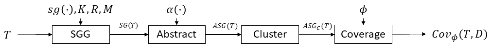

# Approach Pseudocode
The below diagram, Fig. 2 in the paper, describes the components, parameters, and ordering for S<sup>3</sup>C. 
Section 3.2 describes these components and provides several formalisms around their usage.
In this README we present complementary pseudocode implementations for ease of application. The `pipeline/` folder in the root of the repository contains the Python implementation of these components used in the study. 



## 3.2.1 Scene Graph Generation
S<sup>3</sup>C uses as a submodule a scene graph generator (SGG) that maps a set of sensor inputs to a scene graph. 
The SGG is configurable in the kinds of entities, *K*, types and parameters of relationships, *R*, and types and parameters for attributes, *M*.
For example, an SGG studied in prior AV literature, [RoadScene2Vec](https://github.com/AICPS/roadscene2vec) uses configuration files such as [this one](https://github.com/AICPS/roadscene2vec/blob/main/examples/use_case_1_scenegraph_extraction_config.yaml) to define the entities and relations and their parameters, e.g., it lists `ACTOR_NAMES: ["ego_car", "car", ... "bicycle", ...]` as its way of describing *K*.

```python
def get_scene_graph(sensor_input):
    # define the types of entities
    K = ['ego', 'car', 'truck', ...]
    # define the relationships
    R = [('ego', 'truck'), ...]
    # define the attributes
    M = ['color', 'height', ...]
    # invoke the scene graph generator (SGG) function sg
    scene_graph = sg(sensor_input, K, R, M)
    return scene_graph
```

## 3.2.2 Abstraction
The second stage of the S<sup>3</sup>C pipeline utilizes a scene graph abstraction function α to refine the scene graph obtained from the SGG. 
The precise abstraction chosen is an integral part of instantiating the S<sup>3</sup>C framework for a given application.

```python
# This serves as an example abstraction, though any graph to graph function is viable
# In this example, the abstraction removes the ID attribute from all vertices. 
# Removing IDs is useful because many specification preconditions deal solely with entity types rather than entity IDs.
# For example, the spec is likely "... a car on the left" rather than "... car ID 3 on the left"
def abstract_scene_graph(scene_graph):
    # Iterate over all of the vertices and set the id to None
    for vertex in scene_graph:
        vertex.id = None
```

## 3.2.3 Abstraction Clustering
Once a set of abstract scene graphs (ASGs) have been collected we must partition them into equivalence classes, which we refer to as clustering.
Given a set of scene graphs, we create a set of sets of scene graphs where within each set of scene graphs all graphs are isomorphic to each other, and if two scene graphs are not in the same set then they are not isomorphic.

We first present a naive algorithm for clustering that consists of two nested for loops where each scene graph is compared against all existing equivalence classes. Note the pseudocode uses Python List syntax for clarity, but does not rely on order; working with sets would yield equivalent results.

```python
def naive_clustering(sg_list: List[SG]):
    equivalence_classes = []  # List[List[SG]]
    # iterate over all scene graphs so that all graphs are partitioned
    for sg in sg_list:
        found_class = False
        # search over all existing equivalence classes
        for equivalence_class in equivalence_classes:
            # check if sg is isomorphic to the first element of the equivalence_class
            # since all elements in the equivalence_class are isomorphic to each other and isomorphism is transitive,
            # we only need to check the first element
            if is_isomorphic(sg, equivalence_class[0]):
                equivalence_class.append(sg)
                found_class = True
                # This scene graph has been handled, move to the next
                break
        # if the scene graph is not isomorphic to any scene graphs from existing equivalence classes, then create a new class
        if not found_class:
            new_class = [sg]
            equivalence_classes.append(new_class)
    return equivalence_classes
```

The naive clustering algorithm presented above has several weaknesses.
If all scene graphs are unique, then this performs |sg_list|<sup>2</sup>/2 isomorphism checks which are very expensive.
Further, this algorithm cannot be directly parallelized because each scene graph must be compared against all other equivalence classes.
In practice, this is prohibitively slow. 
Thus, we present a more efficient clustering algorithm below and note where it can be parallelized.
This algorithm will first quickly build a coarse partitioning that can then be refined using isomorphism checks.
The implementation explored in the study uses a tuple of the number of vertices and edges as the metadata.

```python
def efficient_clustering(sg_list: List[SG]):
    equivalence_classes = []  # List[List[SG]]
    # the graph meta data map will coarsely partition the graphs
    # the keys will be tuples indicating the number of vertices and edges
    # the values will be lists of scene graphs
    # note that having the same number of vertices and edges is a necessary but not sufficient criteria for isomorphism
    # in practice, any quick-to-compute necessary but not sufficient criteria can be used
    graph_meta_data_map = {}
    # loop once through the data to build the map
    for sg in sg_list:
        # the meta data should be quick to compute
        # many graph implementations give constant time lookup for number of vertices and edges
        meta_data = (sg.num_vertices, sg.num_edges)
        if meta_data not in graph_meta_data_map:
            graph_meta_data_map[meta_data] = []
        graph_meta_data_map[meta_data].append(sg)
    # loop through the coarse partitions and refine them
    # this loop can be fully parallelized
    for meta_data in graph_meta_data_map:
        coarse_sg_list = graph_meta_data_map[meta_data]
        # use the naive approach for these smaller lists
        # still n^2 time, but in practice this will be a much smaller n
        refined_equivalnce_classes = naive_clustering(coarse_sg_list)
        equivalence_classes.append(refined_equivalnce_classes)
    return equivalence_classes
```