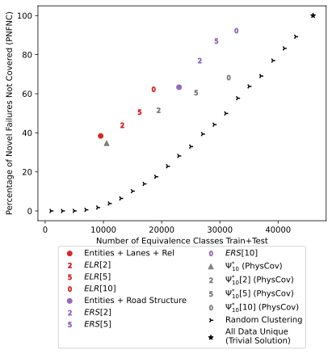

# Multi-frame inputs
As discussed in Section 4.4, our initial exploration has focused only on model-level testing single-instant camera image inputs which may not generalize to system-level failures and multi-frame inputs. 
Here, we provide an initial exploration of extending S<sup>3</sup>C to multi-frame inputs.
As described in Section 4, the data used in the study game from executing 15 tests of 5 minutes each across 4 CARLA Towns under the two different test treatments: zero cars or max cars.
Within each 5 minute test, we obtained all of the relevant inputs at 5Hz.
Although the main evaluation in Section 4 does not consider any relationship between the resulting data, we can leverage the temporal information to provide an initial analysis of how incorporating the time domain affects S<sup>3</sup>C's performance.

To do so, rather than clustering based on the scene graph at a single instant, we will cluster based on a tuple of scene graphs corresponding to the desired time window, i.e., given a time horizon of 2, we cluster based on the pair of scene graphs corresponding to the scene graphs of the current frame and previous frame.

## Calculating multi-frame equivalence classes
To begin, we start by running *ASG<sub>C</sub>* for all of the graphs as described in Section 3.2.3. 
We then assign a unique label to each equivalence class and build a mapping from the scene graph to this label.
Next, we iterate over the frames in *chronological* order and, for each frame, take the most recent *t* frames for time window *t* and build a tuple of length *t* containing the cluster labels of the corresponding scene graphs. 
For a variety of reasons, there may not exist *t* previous scene graphs, for example at the beginning of the test, or if data points were filtered out in the middle of the test.
In these cases, we fill in a label of `UNKNOWN` and consider all `UNKNOWN` data points to be equivalent.
Now, each scene graph has a *t*-tuple describing the equivalence classes of the scene graphs over the previous *t* frames.
We then re-cluster the scene graphs using the *t*-tuple as the basis for equivalence, i.e., two scene graphs are equivalent if they are equivalent *and their previous t-1 graphs are also equivalent*. 
Note that for *t*=1 this is equivalent to the original clustering. 
This algorithm is implemented in `carla/gen_time_sequence.py` and described in pseudocode below.

The new clustering *ASC<sub>C</sub><sup>t</sup>* will have at least as many equivalence classes as *ASG<sub>C</sub>*, but may have many more.

We note that the new clustering retains the interpretability of the scene graphs used to generate the time-tuple, though future work should explore the interpretability of these *sequences* of scene graphs.

```python
def get_time_clustering(frame_list: List[Frame], sg_clustering: Set[Set[SG]], time_window: int):
    # build the mapping from SG to label
    current_label = 0
    sg_label_map = {}
    # each equivalence class will have a unique integer label
    for equivalence_class in sg_clustering:
        for sg in equivalence_class:
            sg_label_map[sg] = current_label
        current_label += 1
    # iterate over the SGs in chronological order to build time tuples
    frame_time_tuple_map = {}
    for frame in frame_list:
        # get the class label for the current SG
        time_tuple = [sg_label_map[frame.sg]]
        # get the previous frame
        prev_frame = frame.previous
        for time in range(time_window - 1):
            if prev_frame is not None and prev_frame.sg is not None:
                # if the previous frame exists and has an SG, add its label
                time_tuple.append(sg_label_map[prev_frame.sg])
            else:
                # if the previous frome does not have an SG, add -1 as a marker for UNKNOWN
                time_tuple.append(-1)
            # get the previous frame
            if prev_frame is not None:
                prev_frame = prev_frame.previous
        frame_time_tuple_map[frame] = time_tuple
    # calculate the equivalence classes based on the time tuples
    time_clustering = perform_clustering(frame_time_tuple_map)
    # the time clustering must have at least as many equivalence classes as the sg-based clustering
    assert len(time_clustering) >= len(sg_clustering)
```
Note: an alternative approach could assign all `UNKNOWN` tuple entries to be distinct from each other, i.e. rather than all `UNKNOWN` being equal to each other, all `UNKNOWN` could be unique. Future work should explore this and other options for handling the time domain

## Results for selected abstractions
In this section, we explore the affect of the time-window approach on the equivalence classes generated under the *ELR*, *ERS*, and Ψ<sup>*</sup><sub>10</sub> techniques for windows of length 2, 5, and 10 frames.

### PNFNC metric under different time windows
In the below figure we see that for each of the abstractions adding more information with the time-window approach improves the performance.
However, we note that the rate of improvement is very different between the abstractions; although starting from similar positions, *ELR*[10] achieves a PNFNC of 62.3% in 18591 equivalence classes compared to the 68.2% of Ψ<sup>*</sup><sub>10</sub>[10] in 31481 equivalence classes. 
From this, we see that adding timing information is proportionately much more beneficial for *ELR* than PhysCov's approach. 
We also note that the time information allows *ELR*[10] to achieve a similar PNFNC performance to *ERS* with single-frame inputs: *ELR*[10] achieves a PNFNC only 1 percentage point lower (62.3% vs 63.3%) while using 19.1% fewer equivalence classes (18591 vs 22987).
Additionally, we observe that although the time-dimension information helps PhysCov increase the PNFNC metric, its performance relative to the random baseline decreases, and it experiences a far greater increase in the number of equivalence classes than either of the scene-graph based approaches.




### Number of Equivalence Classes
<table>
<tr>
<th>Abstraction</th><th>|<i>ASG<sub>C</sub></i>|</th><th>|<i>ASG<sup>2</sup><sub>C</sub></i>|</th><th>|<i>ASG<sup>5</sup><sub>C</sub></i>|</th><th>|<i>ASG<sup>10</sup><sub>C</sub></i>|</th>
</tr>
<tr>
<td><i>ELR</i></td>
<td>9532</td><td>13197</td><td>16180</td><td>18591</td>
</tr>
<tr>
<td><i>ERS</i></td>
<td>22987</td><td>26510</td><td>29372</td><td>32803</td>
</tr>
<tr>
<td>Ψ<sup>*</sup><sub>10</sub></td>
<td>10548</td><td>19440</td><td>25884</td><td>31481</td>
</tr>
</table>